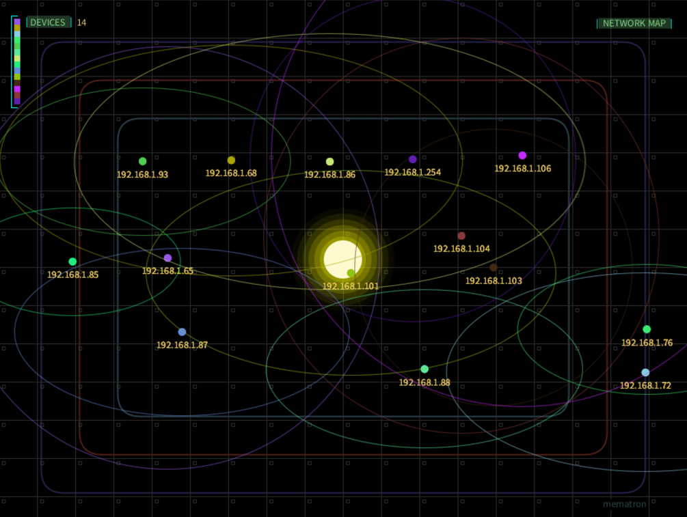
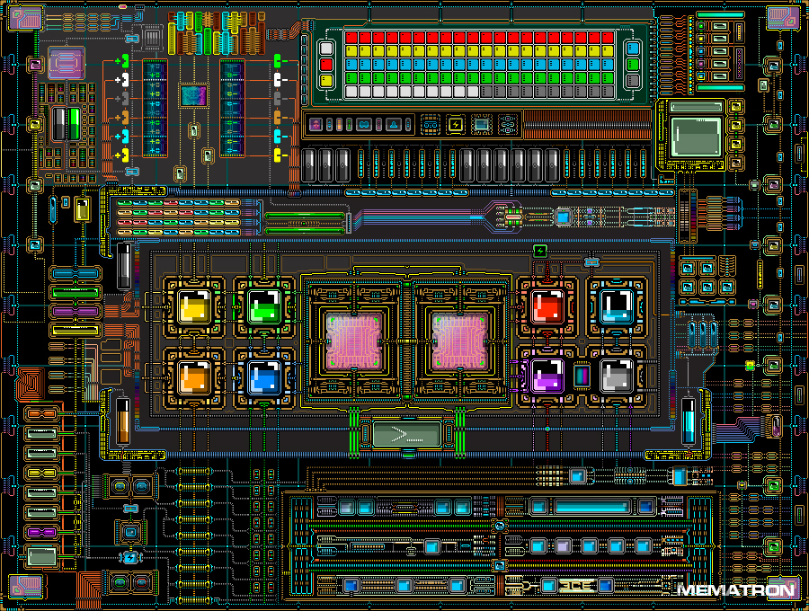

# Network Mapper
### Visual LAN Scanner

Network Mapper is a local area network scanner built in Processing (Java). It scans your LAN and renders the results as an animated, interactive visual display — part network tool, part digital art piece.

> Windows only. Closed source. Free — binary available in Releases.

---

## What It Does

Scans your local network and presents connected devices as a live, fluid visualization. Real-time data rendered through animated visuals with artistic flair — not a spreadsheet, not a terminal dump.

---

## Design

This is not a utilitarian tool with a visual wrapper. The design is the point.

- **Generative loader** — hand-drawn pixel art and generative artwork play before the application launches. The intro is part of the experience.
- **Main interface** — animated network data presented through fluid, dynamic visuals. Every element is considered.
- **Hidden mechanic** — clicking the sun reveals a second screen: a hand-drawn pixel art motherboard showing the application's internal architecture. Art complete. Interactivity in progress.
- **Pixel art** — all art assets are handmade. No stock. No generated imagery.

---

## Technical

- **Language:** Processing (Java)
- **Function:** Local LAN scan
- **Platform:** Windows 10 or later
- **Processor:** Intel Core i3 or equivalent
- **Memory:** 4 GB RAM
- **Graphics:** DirectX 11 compatible
- **Storage:** 200 MB

---

## Download

See [Releases](../../releases) for the Windows binary. Free.

---

## Part of the mematron ecosystem

[ardorlyceum.itch.io](https://ardorlyceum.itch.io) · [linktr.ee/mematron](https://linktr.ee/mematron)
